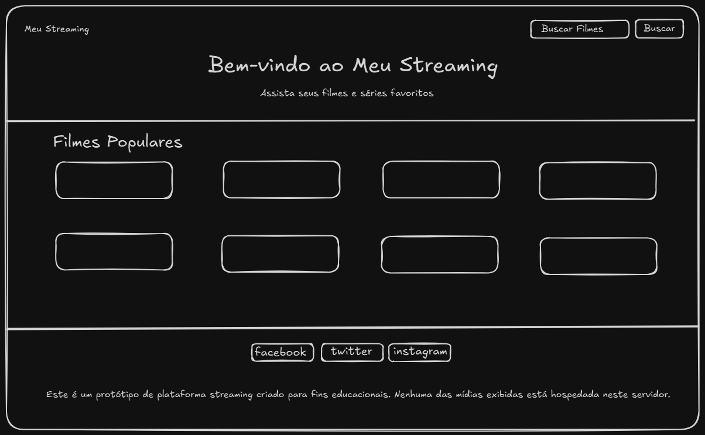
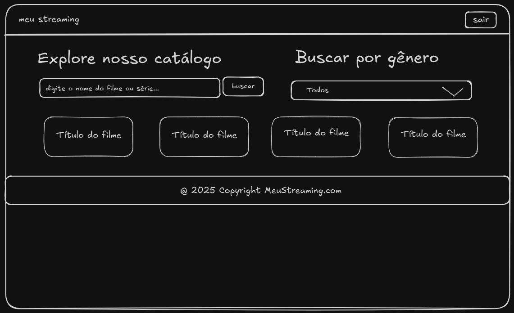
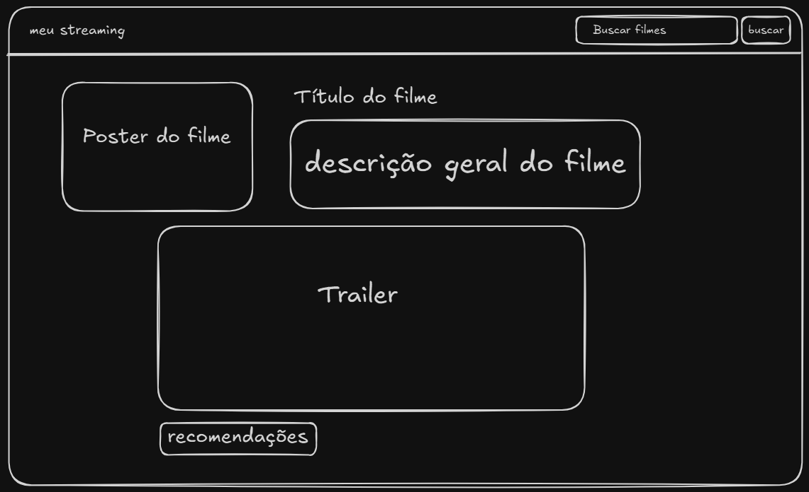

# Meu Streaming 🎬

Bem-vindo ao "Meu Streaming", um projeto de plataforma de streaming de filmes e séries. A aplicação consome múltiplas APIs públicas para exibir um catálogo de mídia dinâmico, visualizações de dados com Chart.js e foca em boas práticas de desenvolvimento, acessibilidade e testes.

## Índice

1.  [Visão Geral e Justificativa](#1-visão-geral-e-justificativa)
2.  [Escopo e Funcionalidades](#2-escopo-e-funcionalidades)
3.  [Wireframe e Protótipo de UI](#3-wireframe-e-protótipo-de-ui)
4.  [Tecnologias Utilizadas](#4-tecnologias-utilizadas)
5.  [APIs Selecionadas](#5-apis-selecionadas)
6.  [Estrutura do Projeto](#6-estrutura-do-projeto)
7.  [Versionamento com Git](#7-versionamento-com-git)
8.  [Acessibilidade e Responsividade](#8-acessibilidade-e-responsividade)
9.  [Testes Automatizados](#9-testes-automatizados)

---

### 1. Visão Geral e Justificativa

**Visão Geral:** O "Meu Streaming" é uma interface web que permite aos usuários navegar por catálogos de filmes, buscar títulos, ver notícias sobre o mundo do entretenimento e entrar em contato através de um formulário. O projeto integra dados de fontes externas e apresenta análises visuais através de gráficos.

**Justificativa:** Este projeto foi escolhido pela oportunidade de trabalhar com desafios técnicos completos, como o consumo de múltiplas APIs, a criação de uma interface de usuário rica e acessível, a implementação de testes automatizados e a prática de um fluxo de trabalho de versionamento profissional com Git.

### 2. Escopo e Funcionalidades

O projeto contará com as seguintes funcionalidades e telas/seções:

- **Página Inicial (`Bem_Vindo.html`):**

  - Visão geral da plataforma com destaques do catálogo.
  - Apresentação dos **planos de assinatura** com botões de ação.
  - Seção de Perguntas Frequentes (FAQ) e um formulário de Newsletter.
  - Uma **visão geral da dashboard** (ex: um gráfico com Chart.js mostrando gêneros populares).

- **Página de Catálogo (`catalogo.html`):**

  - Exibirá o catálogo completo de filmes e séries.
  - Funcionalidade de **busca**, **filtro** e **ordenação** dos resultados.
  - Componente de Paginação para navegar por múltiplos resultados.

- **Página de Pagamento (`pagamento.html`):**

  - Uma nova página para simular o pagamento da assinatura.
  - Exibirá um **QR Code de pagamento fictício (Pix)** gerado dinamicamente com base no plano que o usuário selecionou na página inicial.

- **Página de Detalhes (`detalhes.html`):**

  - Mostra informações completas de um filme/série.

- **Página de Ajuda/Acessibilidade (`ajuda.html`):**
  - Fornece informações sobre os recursos de acessibilidade do site.
  - Oferece uma opção para alternar para um tema de alto contraste.

### 3. Wireframe e Protótipo de UI

Foram criados wireframes de baixa fidelidade para planejar a estrutura visual e a disposição dos elementos nas telas principais do projeto.

#### Página Inicial (Home)

#### Página de Catálogo

#### Página de Detalhes

O design da UI seguirá um tema escuro, com foco na usabilidade e legibilidade, utilizando componentes do Bootstrap 5 para uma prototipação ágil.

### 4. Tecnologias Utilizadas

- **Frontend:** HTML5, CSS3, JavaScript (ES6+), Bootstrap 5.
- **Bibliotecas:** Chart.js (para visualização de dados).
- **Testes:** Selenium (para testes de interface do usuário).
- **Ferramentas:** Git, GitHub, VS Code.

### 5. APIs Selecionadas

1.  **The Movie Database (TMDb) API:**

    - **Propósito:** Fonte principal de dados sobre filmes e séries (pôsteres, sinopses, avaliações, etc.).
    - **Status:** Chave de API a ser obtida.

2.  **QR Code Generator API (`goqr.me`):**

    - **Propósito:** Gerar dinamicamente uma imagem de QR Code para simular um pagamento via Pix. Isso cumpre o requisito de uma segunda API.
    - **Implementação:** A aplicação irá construir um texto no formato "Copia e Cola" do Pix (fictício) contendo o nome do plano e o valor. Esse texto será enviado para a API, que retornará a imagem do QR Code correspondente.
    - **Endpoint Principal:** `https://api.qrserver.com/v1/create-qr-code/?size=150x150&data=SEUTEXTOAQUI`
    - **Status:** Não requer chave, pronta para uso.

3.  **Chart.js (Biblioteca):**
    - **Propósito:** Será utilizada para criar gráficos interativos, como a "visão geral da dashboard" na página inicial, processando dados obtidos da TMDb.

### 6. Estrutura do Projeto

/meu-streaming
|
|-- style.css
|-- script.js
|-- tests
|
|-- Bem_Vindo.html
|-- catalogo.html
|-- detalhes.html
|-- Pagamento.html
|-- ajuda.html
|
|-- /wireframes <-- Imagens do Wireframe
|-- README.md

### 7. Versionamento com Git

O projeto utiliza um fluxo de trabalho baseado no Git Flow, com as seguintes branches:

- **`master`:** Contém o código de produção, estável e pronto para deploy. Cada versão final (entrega) será marcada com uma `tag`.
- **`develop`:** Branch principal de desenvolvimento. Novas funcionalidades são integradas aqui antes de serem enviadas para a `master`.
- **`feature/*`:** Branches temporárias para o desenvolvimento de novas funcionalidades (ex: `feature/formulario-contato`). Após a conclusão, são mescladas na `develop`.

### 8. Acessibilidade e Responsividade

- **Responsividade:** O layout será totalmente adaptável a desktops, tablets e smartphones.
- **Acessibilidade (WCAG):** Serão implementadas práticas como contraste de cores adequado, textos alternativos para imagens, navegação completa via teclado e uso de atributos WAI-ARIA. Haverá uma **opção de acessibilidade** na página de ajuda para ativar um modo de alto contraste.

### 9. Testes Automatizados

#### **Tabela de Casos de Teste**

| ID do Teste | Funcionalidade Testada       | Cenário de Teste                                 | Passos de Execução                                                                                                                     | Resultado Esperado                                                                                                                                              |
| :---------- | :--------------------------- | :----------------------------------------------- | :------------------------------------------------------------------------------------------------------------------------------------- | :-------------------------------------------------------------------------------------------------------------------------------------------------------------- |
| **TC-001**  | **Navegação Principal**      | Navegação da Home para o Catálogo                | 1. Abrir a página inicial (`Bem_Vindo.html`). 2. Clicar no botão/link "Assistir" ou "Login".                                        | O usuário é redirecionado para a página `catalogo.html`. O título `<h1>Explore nosso Catálogo</h1>` está visível.                                               |
| **TC-002**  | **Seleção de Plano**         | Redirecionamento para pagamento do Plano Premium | 1. Abrir a página inicial. 2. Localizar a seção de planos. 3. Clicar no botão "Assinar Agora" do card "Premium".                 | O usuário é redirecionado para a URL `/pagamento.html?plano=premium`. A página de pagamento é carregada.                                                        |
| **TC-003**  | **Geração de QR Code**       | Verificação da criação do QR Code de pagamento   | 1. Acessar a URL `/pagamento.html?plano=padrao`.                                                                                       | O contêiner do QR Code (`#qrcode-container`) deve conter uma tag `` com um `src` válido da API de QR Code. O título da página deve indicar "Plano Padrão". |
| **TC-004**  | **Formulário de Newsletter** | Submissão de e-mail válido                       | 1. Abrir a página inicial. 2. Inserir um e-mail válido (ex: `teste@teste.com`) no campo da newsletter. 3. Clicar em "Inscrever". | Uma mensagem de sucesso (ex: "Obrigado por se inscrever!") é exibida. O campo de e-mail é limpo.                                                                |
| **TC-005**  | **Interatividade do FAQ**    | Funcionalidade do Accordion                      | 1. Abrir a página inicial. 2. Clicar no título de uma pergunta na seção FAQ. 3. Clicar novamente no mesmo título.                | Ao primeiro clique, o corpo da resposta correspondente se torna visível. Ao segundo clique, o corpo da resposta é ocultado.                                  |
| **TC-006**  | **Acessibilidade**           | Alternância de Tema de Alto Contraste            | 1. Abrir a página `ajuda.html`. 2. Clicar no switch "Ativar Modo de Alto Contraste".                                                | O `<body>` da página deve receber uma classe (ex: `high-contrast`), e as cores de fundo e texto devem mudar para um esquema de maior contraste.                 |
| **TC-007**  | **Busca no Catálogo**        | Simulação de busca por um filme                  | 1. Abrir a página `catalogo.html`. 2. Digitar "Inception" no campo de busca. 3. Clicar no botão "Buscar".                        | (Requisito para Etapa 3) A grade de filmes é atualizada, e os cards exibidos devem corresponder aos resultados da busca.                                        |
| **TC-008**  | **Validação de Formulário**  | Submissão de e-mail inválido na Newsletter       | 1. Abrir a página inicial. 2. Inserir um texto inválido (ex: "email-invalido") no campo da newsletter. 3. Clicar em "Inscrever". | Uma mensagem de erro indicando "Por favor, insira um e-mail válido" é exibida abaixo do campo. O formulário não é enviado.                                      |
| **TC-009**  | **Responsividade**           | Verificação do Layout em Dispositivo Móvel       | 1. Abrir a página inicial. 2. Redimensionar a janela do navegador para uma largura de 375px.                                        | Os cards de planos e de filmes devem se reorganizar em uma única coluna. A barra de navegação deve ser substituída por um menu "hambúrguer".                    |

### 10. Como Executar o Projeto

1.  Clone o repositório: `git clone https://github.com/seu-usuario/meu-streaming.git`
2.  Navegue até a pasta do projeto: `cd meu-streaming`
3.  Abra o arquivo `Bem_Vindo.html` em seu navegador.
